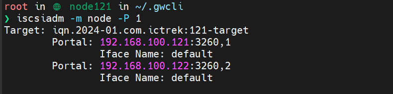
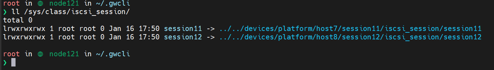

# 1. 初识

## 1. 块存储简介

块存储一般体现形式是卷或者硬盘，数据是按字节来访问的，对于块存储系统而言，对里面的数据内容和格式是一无所知的

换句话说，块存储只负责数据读取和写入，因此性能很高，适用于对响应时间要求很高的系统，例如数据库等

对象存储：对象存储一般体现形式是一个 UUID，数据和元数据打包在一起作为一个整体对象存在一个扁平空间里

## 2. iscsi

### 2.1 简介

简单来说，iscsi 协议是一种存储设备远程映射技术，它可以将一个远程服务器上的存储设备映射到本地，并呈现为一个块设备，从普通用户的角度，映射过来的磁盘与本地自有的磁盘没有差异

暂时无法在飞书文档外展示此内容

iSCSI 基于 TCP/IP 实现，其具体应用方式可以是基于硬件实现，也可以纯软件实现

- 通过硬件实现可以释放 CPU 资源，但是成本较高
- 目前在 Linux 内核中，发起端和目标端都有软件的实现，比如发起端的实现有 open-iscsi，目标端的实现有 LIO、SCST、TGT 等（在Linux 2.6.38 版本后（含），内核集成了 Linux-IO Target）

### 2.2 iscsi 相关概念

1. session：
   1. initiator 和 target 的一组 TCP 连接构成一个 session
   2. 可以向 session 添加 TCP 连接，也可以把 TCP 连接从 session 删除（多路径场景下比较适用）
   3. 同一个 session 的所有连接，initiator 对应的只看到同一个 target
2. connection：
   1. 一个 TCP 连接，Initiator 和 target 之间使用一或者多个 TCP 连接通信
   2. CID(Connection ID): 一个 session 里的每个 connection 用 CID 进行标识，该标识在 session 范围内是唯一。CID 由 initiator 产生，在 login 请求和使用 logout 关闭 连接时传递给 target

### 2.3 iscsi 相关操作

1. 查看已连接到的 iscsi 的节点信息

```Bash
iscsiadm -m node -P 1
```



- 以 121 环境举例，建立了

1. 查看已建立的 iscsi session：

   ```bash
   # /sys/class 目录是 Linux 系统中的一个虚拟文件系统，用于提供设备类别的信息。这个目录包含了系统中所有设备类别的信息，每个设备类别又包含了相应的设备实例
   ll /sys/class/iscsi_session/
   ```

   

   

2. 