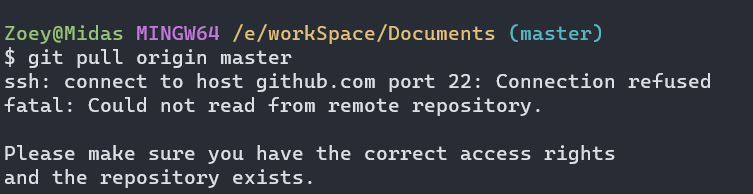
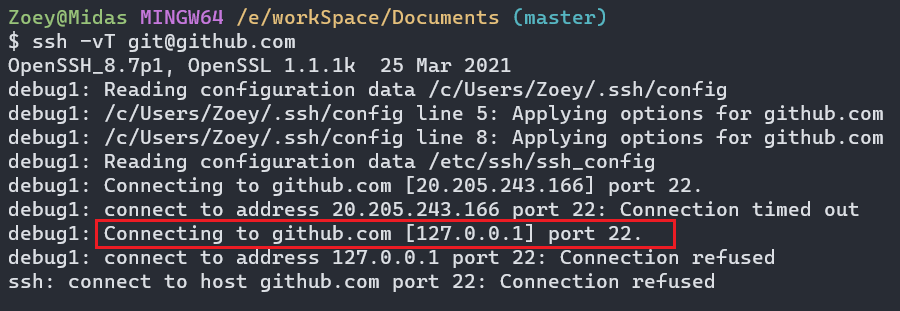
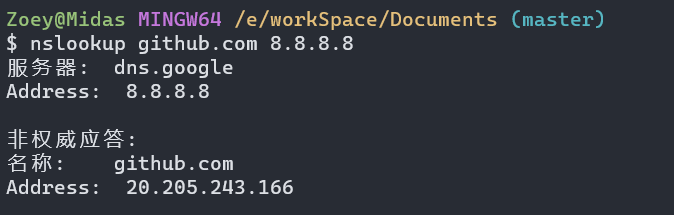

# 1. ssh: connect to host github.com port 22: Connection refused



背景：

没有对 git 环境修改过，但是在某一天突然连接拒绝，重新创建密钥对后仍然连接失败

解决：

1. 方法一：从 ssh 换成 http 连接
   ```cmd
   git remote set-url 仓库名 仓库地址
   ```

2. 方法二：更换端口
   进行其他端口连接测试

   ```cmd
   ssh -T -p 443 git@ssh.github.com
   ```

   如果 443 端口可通行则可修改配置，否则参考方法三

   ```cmd
   vim ~/.ssh/config
   ```

   将对应 port 从 22 改成 443，保存退出

3. 方法三：

   1. 调试连接过程，查找错误
      ```cmd
      ssh -vT git@github.com
      ```

      

   2. 确定为 DNS 错误，修改指向 IP

      连接 github 时发现是尝试连接 localhost，确定DNS解析出问题了，导致 github 域名被解析成了localhost 的 ip 地址，所以连接失败

      - 查找 GitHub 的 ip
        ```cmd
        nslookup github.com 8.8.8.8
        ```

        

      - 更新为正确的 IP 并刷新本机 DNS 缓存
        `hosts` 文件在 `C:\Windows\System32\drivers\etc` 
        利用记事本打开后添加一条 github 的地址映射
        

​		（经验证，国内开启代理时解析出的 20.205.243.166 不可用，需要添加 140.82.113.4 映射）